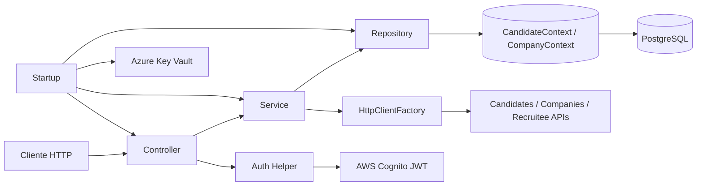

# Arquitectura técnica del backend (`CandidatesMS`)

## 1) Resumen ejecutivo
Este backend es una API monolítica en **ASP.NET Core (.NET 8)** con una arquitectura por capas (Controladores → Servicios → Repositorios → EF Core), que integra autenticación JWT con **AWS Cognito**, persistencia sobre **PostgreSQL** con **dos contextos EF Core** (candidatos y compañías), y consumo de servicios externos por `HttpClient`.

## 2) Stack tecnológico
- **Runtime / framework:** `Microsoft.NET.Sdk.Web` sobre `net8.0`.
- **Web API:** ASP.NET Core MVC + controladores con rutas `api/[controller]`.
- **Persistencia:** Entity Framework Core + proveedor `Npgsql` (PostgreSQL).
- **AuthN/AuthZ:** JWT Bearer con 2 esquemas (`candidates`, `companies`) respaldados por AWS Cognito.
- **Cloud/externos:** Azure Key Vault (secretos), AWS S3/Textract/Cognito, MailKit.
- **Utilitarios:** AutoMapper, FluentValidation, Newtonsoft.Json, Swashbuckle.

## 3) Estructura de alto nivel
```text
Program.cs
  └── Startup.cs
      ├── Carga secretos (Azure Key Vault)
      ├── Configura DI (repositorios, servicios, helpers)
      ├── Configura Auth JWT (Cognito)
      ├── Configura EF Core (CandidateContext + CompanyContext)
      ├── Configura HttpClient (Candidates, Companies, Recruitee)
      └── Pipeline HTTP (Auth, Routing, CORS, Endpoints)

Controllers/*            -> Capa de entrada HTTP (52 controladores)
Services/*               -> Lógica de negocio (candidato)
ServicesCompany/*        -> Lógica de negocio (compañía)
Persistence/Infraestructure/* -> Repositorios dominio candidato
Persistence/InfrastructureCompany/* -> Repositorios dominio compañía
Persistence/DbContext/*  -> Contextos EF Core
Persistence/Entities*    -> Entidades de base de datos
```

## 4) Arranque y composición de la aplicación
- `Program.cs` usa `Host.CreateDefaultBuilder` y delega la configuración en `Startup`.
- En `Startup.ConfigureServices` se construye la configuración operativa: secretos, base de datos, autenticación, DI, validadores, clientes HTTP y límites de carga.
- En `Startup.Configure` se aplica el pipeline: `UseAuthentication`, `UseRouting`, `UseAuthorization`, `UseCors`, redirección HTTPS y mapeo de controladores.

## 5) Gestión de configuración y secretos
El backend no depende únicamente de `appsettings`; usa el archivo para **nombres/identificadores de secretos** y credenciales de acceso a Key Vault, luego resuelve valores reales desde Azure Key Vault en runtime.

**Secretos resueltos dinámicamente:**
- Connection strings (`Candidate` y `Company`).
- URLs de otros servicios (`Candidates`, `Companies`, `Recruitee`).
- Credenciales AWS (S3 y S3 Textract).
- Parámetros Cognito.
- Configuración de correo (SMTP/IMAP).

## 6) Arquitectura de datos
### 6.1 Dos contextos EF Core
- `CandidateContext`: concentra el modelo de datos de candidatos (perfil, cv, estudios, idiomas, preferencias, etc.).
- `CompanyContext`: concentra entidades orientadas a compañía (tags, fuentes, evaluaciones, miembros, etc.).

Esto permite separar dominios lógicos dentro de la misma API y aislar accesos por repositorio.

### 6.2 Patrón repositorio
Existe un repositorio base genérico con operaciones CRUD y repositorios específicos por agregado.

Flujo típico:
1. El controlador recibe request.
2. Delega en servicio y/o repositorio específico.
3. El repositorio usa `_context` (o `_contextCompany`) y `DbSet<TEntity>`.
4. EF Core persiste en PostgreSQL.

## 7) Capa de aplicación (servicios)
La capa de servicios encapsula reglas de negocio y coordinación de múltiples repositorios. En el proyecto se observan dos grupos:
- Servicios de dominio candidato (`Services/*`).
- Servicios de dominio compañía (`ServicesCompany/*`).

`CandidateService` y `CandidateController` muestran un enfoque de orquestación amplia (muchas dependencias), útil para casos complejos de perfil/cv/documentación, aunque con alto acoplamiento constructor.

## 8) API y contrato HTTP
- Convención base en controladores: `[Route("api/[controller]")]`.
- Respuestas frecuentes con envelope `{ message, obj }`.
- Se manejan códigos `200`, `404`, `500` en endpoints representativos.
- Tamaño de request body ampliado al máximo (`IIS` y `Kestrel`) para soportar archivos pesados.

## 9) Seguridad
### 9.1 Autenticación
Se configuran **dos esquemas JWT Bearer**:
- `candidates`
- `companies`

Ambos validan issuer de Cognito y resuelven llaves JWKS desde `/.well-known/jwks.json`.

### 9.2 Autorización
La política por defecto exige usuario autenticado y acepta ambos esquemas.

### 9.3 CORS
La política habilitada permite cualquier origen/método/header y expone `Content-Disposition`.

## 10) Integraciones externas
- **AWS S3 / Textract:** vía configuración inyectada (`ServiceConfigurationDTO`) y servicios auxiliares.
- **AWS Cognito:** autenticación JWT y servicios de actualización de usuario.
- **Servicios internos remotos:** clientes nombrados `Candidates`, `Companies`, `Recruitee` con `IHttpClientFactory`.
- **Email:** configuración y repositorios/servicios de correo con MailKit.

## 11) Escalabilidad y mantenibilidad (evaluación técnica)
### Fortalezas
- Patrón por capas claro y consistente.
- Separación de dominio por contextos de datos.
- Integración cloud madura (Key Vault + Cognito + S3).
- Registro DI explícito y completo.

### Riesgos / deuda técnica observable
- **Constructores muy grandes** en componentes críticos (controlador/servicio de candidato).
- **Configuración centralizada extensa** en `Startup` (alta complejidad en un solo punto).
- Potencial mezcla de responsabilidades (controladores con mucha orquestación).

## 12) Recomendaciones concretas
1. **Modularizar DI por extensión** (`services.AddCandidateModule()`, etc.) para reducir complejidad de `Startup`.
2. **Reducir acoplamiento** en controladores/servicios dividiendo casos de uso por vertical slices.
3. **Estandarizar respuesta API** con un contrato común versionado (si aplica).
4. **Fortalecer observabilidad** (logging estructurado + trazabilidad + métricas de integraciones externas).
5. **Revisar exposición de secretos en config local** y reforzar políticas de manejo seguro en repositorio.

## 13) Diagrama de flujo de request (simplificado)


---

Si quieres, en una siguiente iteración te lo convierto a versión “**C4 model**” (Contexto, Contenedores, Componentes) con diagramas más formales y un mapa de dependencias por módulo.


## 14) Continuación: mapa de arquitectura de la solución
Para profundizar la vista arquitectónica (C4 contexto/contenedores/componentes, flujos runtime e inventario técnico), revisa también:

