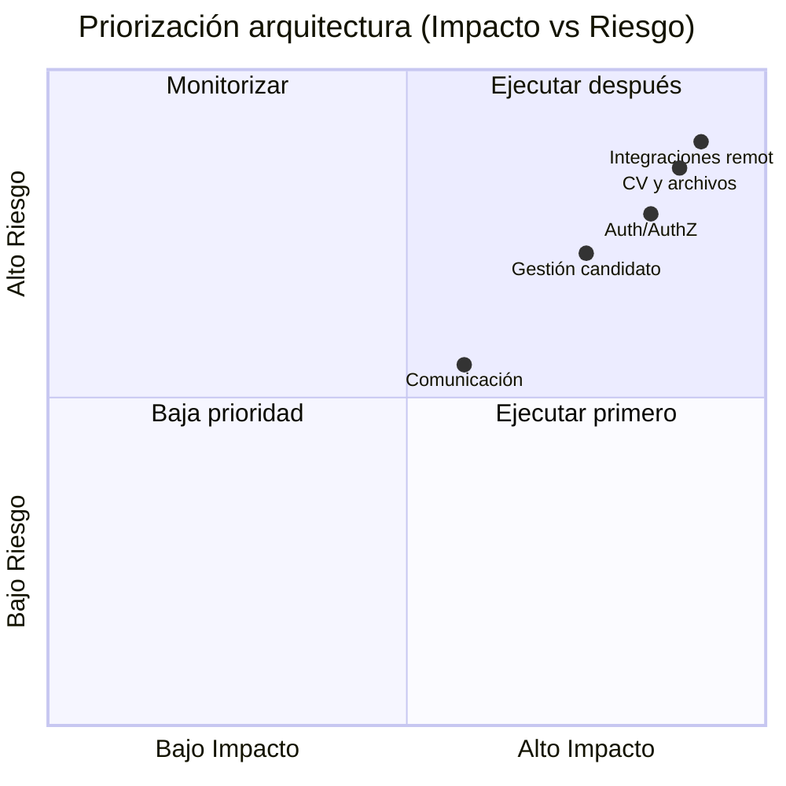

# Capacidades y endpoints críticos (arquitectura funcional) — `CandidatesMS`

## Objetivo
Mapear capacidades de negocio/tecnología a endpoints críticos para priorizar calidad, observabilidad y evolución arquitectónica.

## Capacidad 1: Gestión de candidato
- **Descripción:** alta, consulta y mantenimiento del perfil candidato.
- **Endpoints representativos:**
  - `GET /api/candidate`
  - `GET /api/candidate/{candidateId}`
  - `GET /api/candidate/getCandidateByToken`
- **Riesgo técnico:** acoplamiento de servicio/controlador y dependencia de mapeo DTO.
- **Prioridad arquitectura:** Alta.

## Capacidad 2: CV y archivos
- **Descripción:** carga, almacenamiento y procesamiento de CV/documentos.
- **Componentes relacionados:** controladores de CV/adjuntos + integración S3/Textract.
- **Riesgo técnico:** latencia externa, tamaño de payload, robustez de validación.
- **Prioridad arquitectura:** Alta.

## Capacidad 3: Integraciones remotas
- **Descripción:** operaciones cruzadas con `Companies API` y `Recruitee`.
- **Componentes relacionados:** `CompanyRemoteRepository`, clientes HTTP nombrados.
- **Riesgo técnico:** fallos de red, timeouts, consistencia eventual.
- **Prioridad arquitectura:** Alta.

## Capacidad 4: Autenticación y autorización
- **Descripción:** validación JWT para `candidates` y `companies`.
- **Componentes relacionados:** configuración JWT/Cognito, policies globales.
- **Riesgo técnico:** degradación por validación JWKS remota y errores de issuer/audience.
- **Prioridad arquitectura:** Alta.

## Capacidad 5: Comunicación y notificaciones
- **Descripción:** envío/gestión de correo y trazas de comunicación.
- **Componentes relacionados:** repositorios/servicios de mail.
- **Riesgo técnico:** fiabilidad de proveedor SMTP/IMAP y seguimiento de entregas.
- **Prioridad arquitectura:** Media.

## Mapa de priorización para iteraciones

## Uso recomendado
1. Tomar este catálogo como base de priorización de SLO.
2. Asociar cada capacidad a KPIs técnicos y ADRs relevantes.
3. Revisar trimestralmente el nivel de riesgo/impacto por capacidad.

