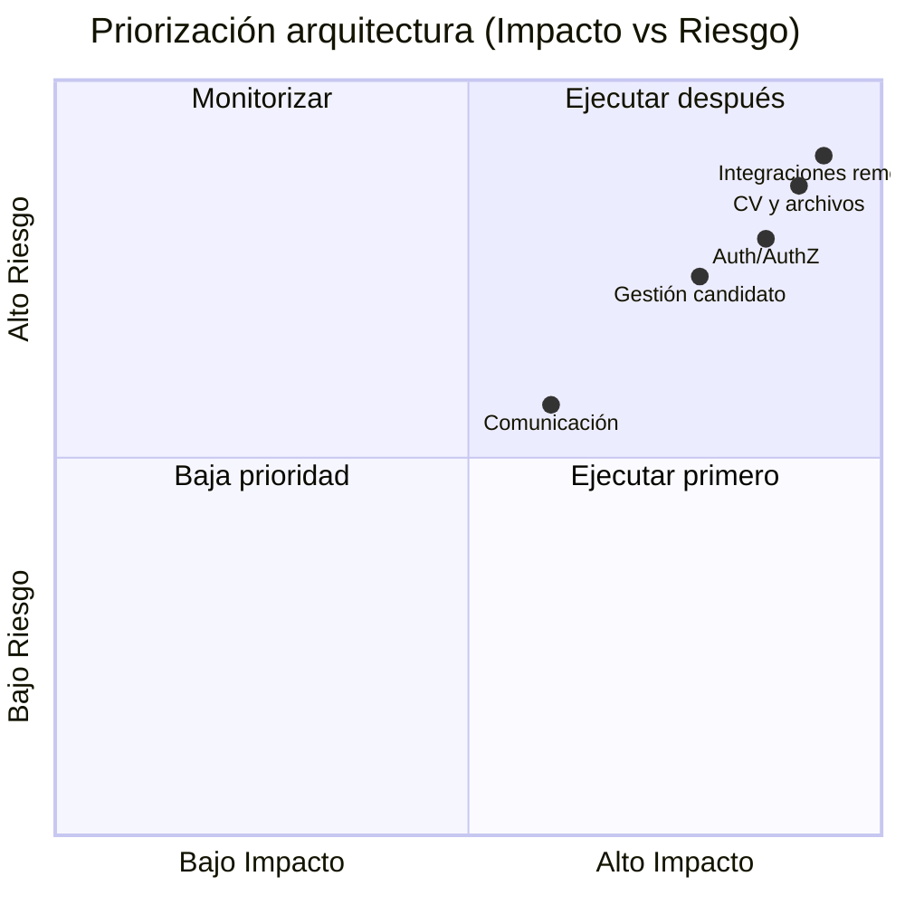

# Capacidades y endpoints críticos (arquitectura funcional) — `CandidatesMS`

## Objetivo
Mapear capacidades de negocio y capacidades técnicas a endpoints críticos para priorizar hardening, observabilidad y evolución arquitectónica en iteraciones cortas.

## Alcance
Este documento resume los flujos que concentran mayor impacto operativo:
- Entrada autenticada de candidatos y compañías.
- Gestión de perfil candidato y ciclo de CV/documentos.
- Integraciones remotas (Companies API / Recruitee / servicios cloud).
- Comunicación transaccional y trazabilidad básica.

## Matriz de capacidades críticas
| Capacidad | Endpoints / componentes representativos | Riesgo principal | Impacto | Prioridad |
|---|---|---|---|---|
| Gestión de candidato | `GET /api/candidate`, `GET /api/candidate/{candidateId}`, `GET /api/candidate/getCandidateByToken` | Acoplamiento servicio-controlador, múltiples DTOs y reglas de negocio en un solo flujo | Alto | Alta |
| CV y archivos | Endpoints de CV/adjuntos + S3/Textract | Latencia externa, payloads grandes, fallos parciales en procesamiento | Alto | Alta |
| Integraciones remotas | `CompanyRemoteRepository` + `HttpClient` nombrados (`Companies`, `Recruitee`) | Timeouts, reintentos no homogéneos, consistencia eventual | Alto | Alta |
| AuthN/AuthZ | Esquemas JWT `candidates` / `companies` + validación Cognito/JWKS | Errores de issuer/audience, dependencia de metadata remota | Alto | Alta |
| Comunicación y notificaciones | Servicios/repositorios de mail | Fiabilidad SMTP/IMAP, baja trazabilidad de entrega | Medio | Media |

## Capacidad 1: Gestión de candidato
**Descripción:** alta, consulta y mantenimiento del perfil candidato.

**Endpoints representativos:**
- `GET /api/candidate`
- `GET /api/candidate/{candidateId}`
- `GET /api/candidate/getCandidateByToken`

**Riesgos técnicos observables:**
- Alta concentración de dependencias en capa de aplicación.
- Mayor probabilidad de regresión al tocar reglas transversales.

**Recomendaciones inmediatas:**
1. Separar casos de uso (lectura, actualización, enriquecimiento).
2. Estandarizar contrato de respuesta y errores de dominio.

## Capacidad 2: CV y archivos
**Descripción:** carga, almacenamiento y procesamiento de CV/documentos.

**Componentes relacionados:**
- Controladores de CV/adjuntos.
- Integración con S3 y procesamiento Textract.

**Riesgos técnicos observables:**
- Tiempos de respuesta variables por dependencia externa.
- Riesgo de fallos parciales en cadena (upload → parseo → persistencia).

**Recomendaciones inmediatas:**
1. Definir timeout/retry/circuit-breaker por integración.
2. Incorporar idempotencia y correlación por `traceId`.

## Capacidad 3: Integraciones remotas
**Descripción:** operaciones cruzadas con APIs internas y terceros.

**Componentes relacionados:**
- `CompanyRemoteRepository`.
- Clientes HTTP nombrados vía `IHttpClientFactory`.

**Riesgos técnicos observables:**
- Puntos de falla de red y errores transitorios.
- Falta de políticas homogéneas de resiliencia.

**Recomendaciones inmediatas:**
1. Unificar políticas de resiliencia por cliente remoto.
2. Publicar métricas por dependencia (latencia p95/p99, tasa de error).

## Capacidad 4: Autenticación y autorización
**Descripción:** validación JWT para esquemas `candidates` y `companies`.

**Componentes relacionados:**
- Configuración JWT/Cognito.
- Políticas globales de autorización.

**Riesgos técnicos observables:**
- Dependencia de resolución de llaves (`JWKS`) y metadata remota.
- Errores de configuración de issuer/audience entre ambientes.

**Recomendaciones inmediatas:**
1. Checklist de configuración por entorno.
2. Monitoreo de fallos de autenticación por causa.

## Capacidad 5: Comunicación y notificaciones
**Descripción:** envío/gestión de correo y trazas de comunicación.

**Componentes relacionados:**
- Repositorios/servicios de correo.

**Riesgos técnicos observables:**
- Dependencia del proveedor SMTP/IMAP.
- Visibilidad limitada de entrega/rebote.

**Recomendaciones inmediatas:**
1. Registrar eventos de envío/entrega/error con correlación.
2. Definir reintentos con umbral y alertas.

## Mapa de priorización para iteraciones

## Plan sugerido de siguiente iteración
1. **Semana 1:** baseline de métricas y trazas para flujos críticos (auth, candidate, CV).
2. **Semana 2:** resiliencia de integraciones remotas (timeouts/retry/circuit-breaker).
3. **Semana 3:** endurecimiento de errores de dominio y contrato API.
4. **Semana 4:** revisión de KPIs y ajuste de backlog de deuda técnica.

## KPIs mínimos recomendados
- Disponibilidad por endpoint crítico (`%`).
- Latencia p95/p99 por capacidad.
- Tasa de error 4xx/5xx segmentada por dominio.
- Fallos de integración externa por dependencia.
- Éxito de procesamiento de CV/documentos.

## Uso recomendado
1. Tomar este catálogo como base de priorización de SLO.
2. Asociar cada capacidad a ADRs y responsables.
3. Revisar quincenalmente el nivel de riesgo/impacto por capacidad.
