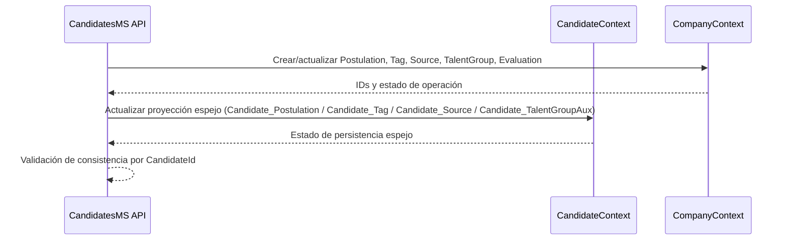

# Diagrama de interacción entre bases de datos y tablas clave (`CandidatesMS`)

## Objetivo
Completar la documentación de arquitectura con una vista explícita de **cómo interactúan las dos bases de datos lógicas del sistema** (`CandidateContext` y `CompanyContext`) y qué tablas participan en esos cruces.

## 1) Vista de interacción entre contextos de datos
```mermaid
flowchart LR
  subgraph CDB[Candidate DB (CandidateContext)]
    C1[Candidate]
    C2[BasicInformation]
    C3[Description]
    C4[ExperienceCount]
    C5[Candidate_Postulation]
    C6[Candidate_TalentGroupAux]
    C7[Candidate_Tag]
    C8[Candidate_Source]
    C9[DocumentCheck]
  end

  subgraph CoDB[Company DB (CompanyContext)]
    O1[Postulation]
    O2[Candidate_TalentGroup]
    O3[Candidate_Tag]
    O4[Candidate_Source]
    O5[Evaluation]
    O6[Job]
    O7[TalentGroup]
    O8[Tag]
    O9[Source]
  end

  C1 -. CandidateId .- O1
  C1 -. CandidateId .- O2
  C1 -. CandidateId .- O3
  C1 -. CandidateId .- O4
  C1 -. CandidateId .- O5

  C5 -. PostulationId + CandidateId .- O1
  C6 -. CandidateId + TalentGroupId .- O2
  C7 -. CandidateId + TagId .- O3
  C8 -. CandidateId + SourceId .- O4

  O1 --> O6
  O2 --> O7
  O3 --> O8
  O4 --> O9

  C1 --> C2
  C1 --> C3
  C1 --> C4
  C1 --> C9
```

## 2) Tabla de interacciones críticas entre bases
| Tabla en CandidateContext | Tabla en CompanyContext | Llaves de interacción | Uso funcional |
|---|---|---|---|
| `Candidate` | `Postulation` | `CandidateId` | Estado de postulaciones del candidato |
| `Candidate_Postulation` | `Postulation` | `PostulationId`, `CandidateId` | Proyección espejo de embudo |
| `Candidate_TalentGroupAux` | `Candidate_TalentGroup` | `CandidateId`, `TalentGroupId` | Segmentación en grupos de talento |
| `Candidate_Tag` | `Candidate_Tag` | `CandidateId`, `TagId` | Clasificación por etiquetas |
| `Candidate_Source` | `Candidate_Source` | `CandidateId`, `SourceId` | Origen de candidato |
| `Candidate` | `Evaluation` | `CandidateId` | Evaluaciones en procesos de selección |

## 3) Flujo de datos entre contextos (sincronización lógica)


## 4) Reglas de consistencia recomendadas
1. Tratar `CompanyContext` como fuente de verdad para estados de reclutamiento (`Postulation`, `Evaluation`, taxonomías).
2. Mantener proyecciones en `CandidateContext` mediante operaciones idempotentes.
3. Registrar timestamps de sincronización para detectar drift entre contextos.
4. Definir job de reconciliación periódica por claves compuestas (`CandidateId + dimensión`).

## 5) Checklist de impacto al cambiar tablas que interactúan
- [ ] ¿Cambió una clave de interacción (`CandidateId`, `PostulationId`, `TagId`, `SourceId`, `TalentGroupId`)?
- [ ] ¿Se actualizó la lógica de proyección espejo en CandidateContext?
- [ ] ¿Se ajustó reporting que consume datos cruzados Candidate/Company?
- [ ] ¿Se planificó backfill/reconciliación para datos históricos?

## 6) Referencias
- `docs/mapa-relaciones-bd.md`
- `docs/catalogo-tablas-campos-relaciones.md`
- `docs/diccionario-datos-entidades-criticas.md`

