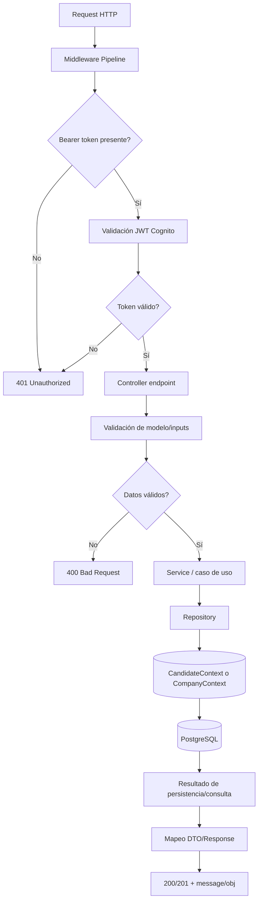
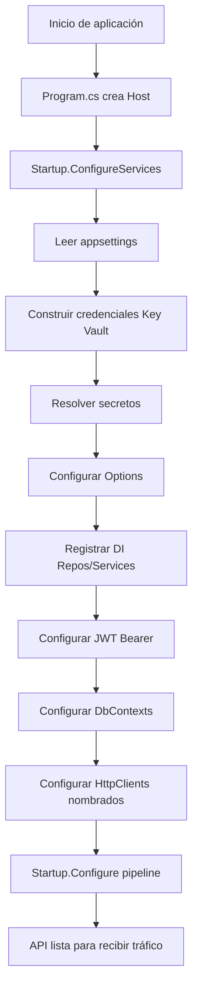
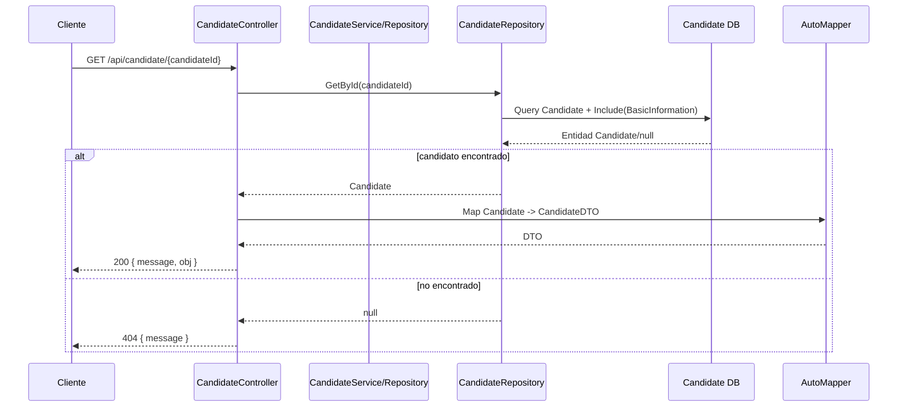
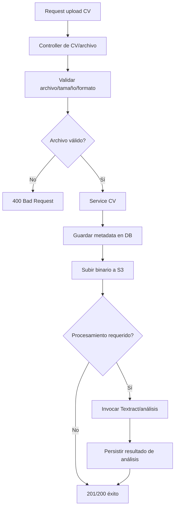
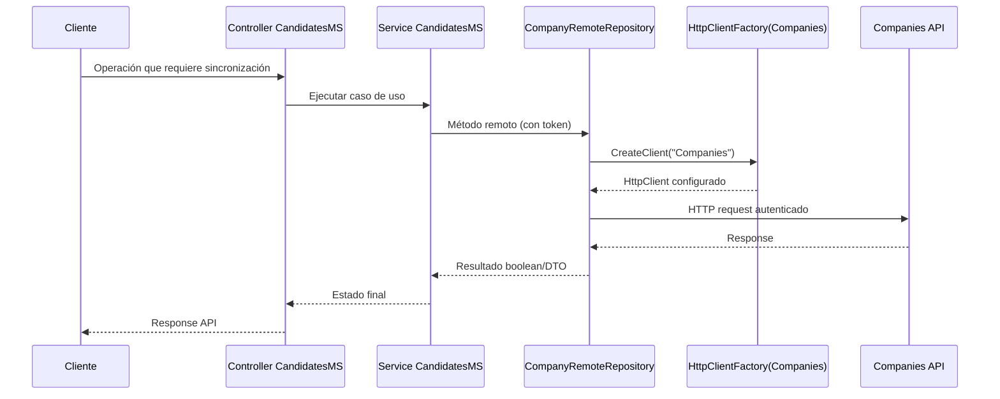
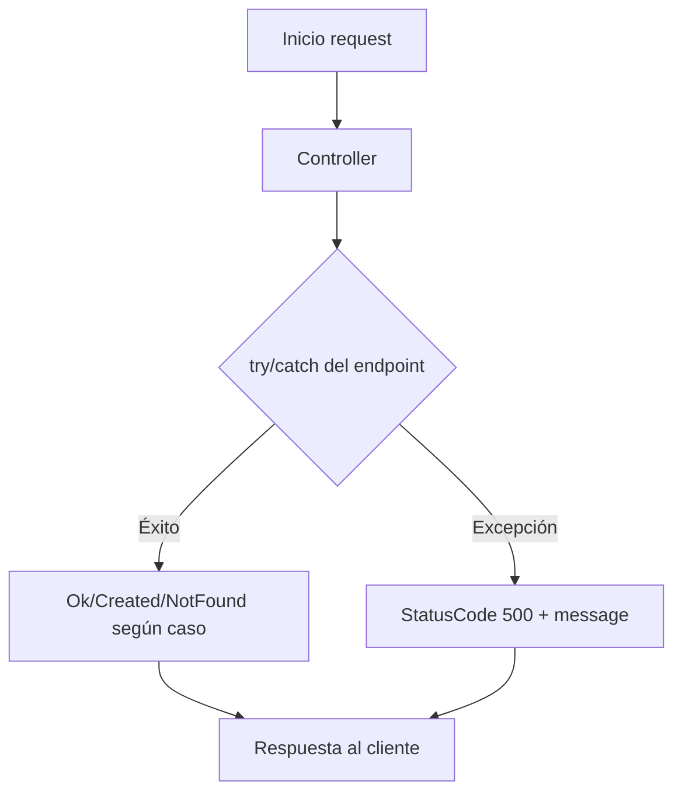
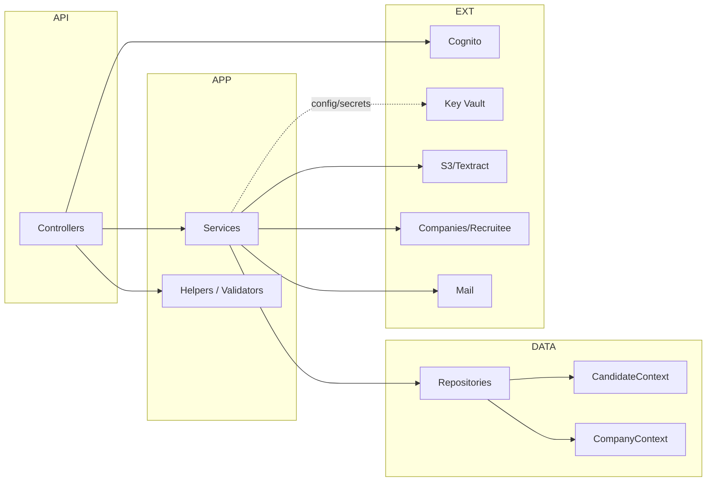

# Diagramas de flujo de procesos internos de la API (`CandidatesMS`)

## Objetivo
Documentar los **procesos internos más relevantes** de la API para entender cómo se ejecutan las operaciones desde que entra una request hasta que se responde al cliente, incluyendo autenticación, capa de servicios, persistencia e integraciones externas.

> Nota: los diagramas están modelados a partir de la arquitectura y convenciones observadas en la solución (Controllers → Services → Repositories → DbContexts + integraciones cloud/remotas).

## 1) Flujo interno estándar de una request autenticada

## 2) Flujo de inicialización de la API (startup/bootstrap)

## 3) Flujo de consulta de candidato por ID

## 4) Flujo de carga/procesamiento de CV (alto nivel)

## 5) Flujo de operación remota con `Companies API`

## 6) Flujo de errores y control de respuesta

## 7) Mapa de procesos internos por capa

## 8) Recomendación para siguiente iteración
Para convertir estos diagramas en una herramienta de operación del equipo, el siguiente paso ideal es:
1. Priorizar 5 procesos críticos (ej. alta candidato, actualización perfil, carga CV, envío correo, sincronización con companies).
2. Asociar cada proceso a endpoints concretos + servicios + repositorios.
3. Agregar SLAs/SLOs y puntos de observabilidad (logs, métricas, trazas) en cada diagrama.
4. Mantenerlos versionados junto con cambios de código (Definition of Done documental).