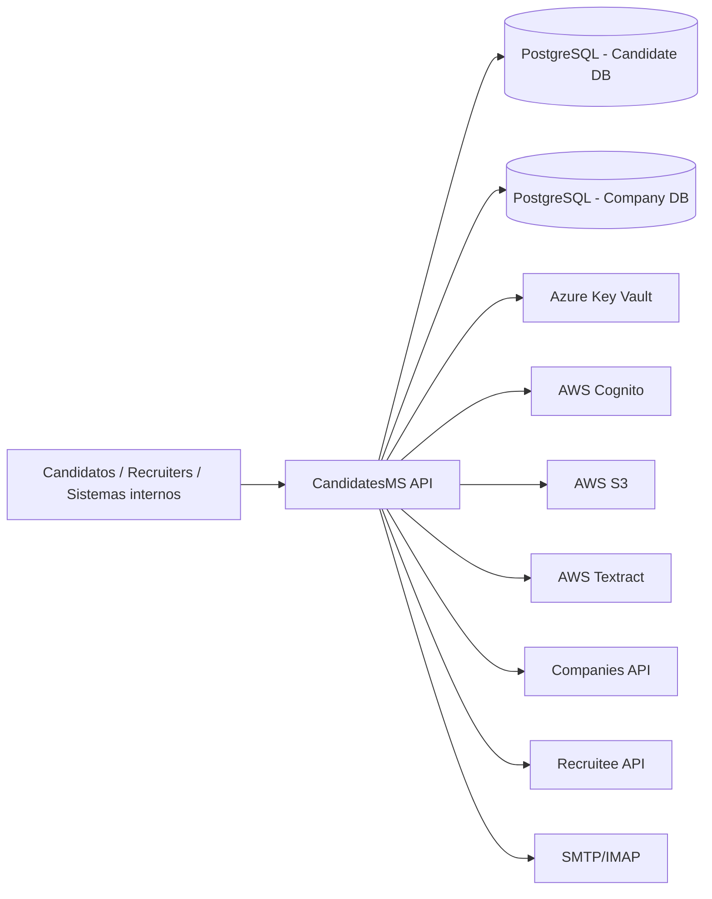
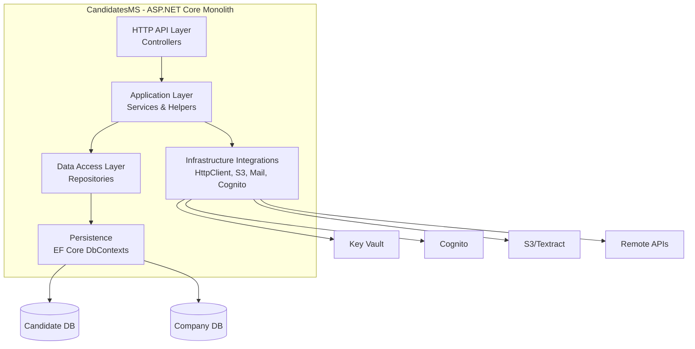
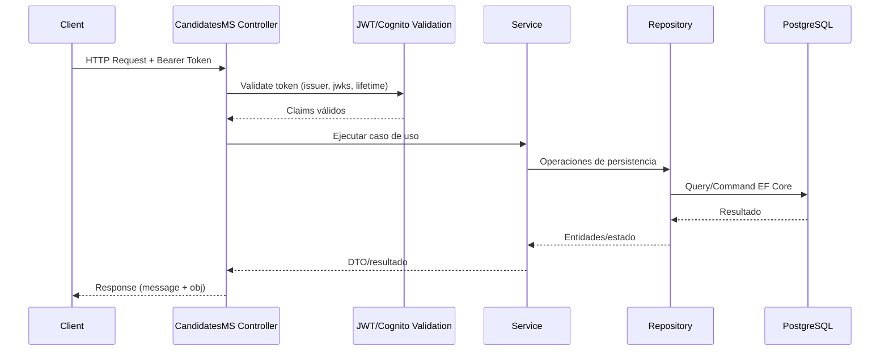
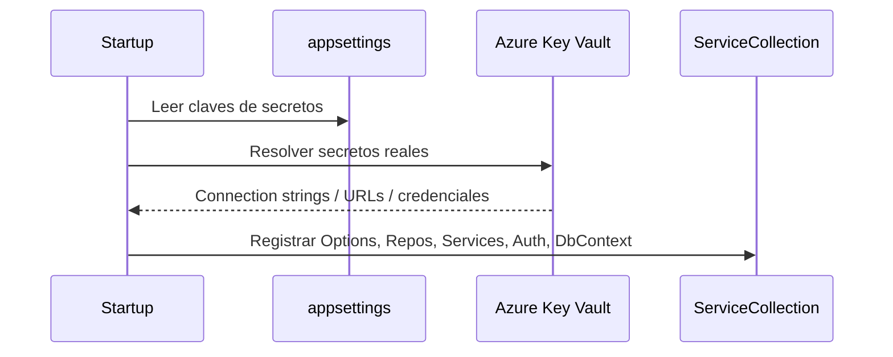

# Mapa de arquitectura de la solución (`Staff` / `CandidatesMS`)

## Objetivo
Este documento extiende la documentación anterior y presenta un **mapa arquitectónico** más concreto de la solución: contexto, contenedores, componentes, flujos clave e inventario técnico para facilitar mantenimiento, onboarding y evolución.

## 1) Vista de contexto (C4 - Nivel 1)


### Actores y sistemas externos
- **Usuarios/API clients:** aplicaciones que consumen endpoints de candidatos, CV, documentos y analítica de perfil.
- **Azure Key Vault:** fuente de secretos operativos.
- **AWS Cognito:** emisor/validador de tokens JWT (dos dominios de autenticación).
- **AWS S3/Textract:** almacenamiento de archivos y procesamiento documental.
- **APIs remotas (`Companies`, `Recruitee`):** dependencias de negocio para sincronización y operaciones cruzadas.

## 2) Vista de contenedores (C4 - Nivel 2)


## 3) Vista de componentes (C4 - Nivel 3)

## 3.1 Arranque y composición
- `Program` inicializa el host web y delega la composición en `Startup`.
- `Startup.ConfigureServices` concentra:
  - resolución de secretos,
  - registro de DI por dominios (`Candidate` y `Company`),
  - autenticación JWT,
  - DbContexts,
  - HttpClients nombrados.
- `Startup.Configure` define middleware pipeline.

## 3.2 Componentes principales por capa

### API Layer (Controllers)
- Alto número de controladores especializados por recurso de dominio (candidato, idiomas, estudios, archivos, etc.).
- Convención de ruta uniforme `api/[controller]`.
- Envelope frecuente de respuesta: `message` + `obj`.

### Application Layer (Services)
- Orquesta reglas de negocio y consistencia entre múltiples repositorios.
- Servicios divididos por dominio:
  - `Services/*` (orientado a candidato).
  - `ServicesCompany/*` (orientado a compañía).

### Data Access Layer (Repositories)
- Repositorio genérico base con CRUD común.
- Repositorios específicos por agregado para consultas y operaciones de negocio.
- Integración con dos contextos EF Core según dominio.

### Infrastructure Integrations
- **Auth:** validación JWT contra JWKS de Cognito.
- **Remote:** `IHttpClientFactory` para clientes nombrados.
- **Storage:** S3/Textract para archivos y procesamiento.
- **Mail:** repositorios/servicios de correo.

### Persistence
- `CandidateContext`: catálogo amplio de entidades del ciclo de vida del candidato.
- `CompanyContext`: entidades para operaciones de compañía y evaluación.

## 4) Mapa físico/lógico del código
```text
CandidatesMS/
├── Program.cs
├── Startup.cs
├── Controllers/
│   └── *Controller.cs (API endpoints)
├── Services/
│   └── servicios dominio candidato
├── ServicesCompany/
│   └── servicios dominio compañía
├── Persistence/
│   ├── DbContext/
│   │   ├── CandidateContext.cs
│   │   └── CompanyContext.cs
│   ├── Entities/
│   ├── EntitiesCompany/
│   ├── Infraestructure/
│   ├── InfrastructureCompany/
│   └── Seed/
├── Repositories/
├── RepositoriesCompany/
└── Models/
```

## 5) Flujos de arquitectura (runtime)

## 5.1 Flujo de request autenticado


## 5.2 Flujo de configuración al iniciar


## 6) Inventario técnico resumido
- **Controladores:** ~52.
- **Repositorios (dominio candidato):** ~82.
- **Repositorios (dominio compañía):** ~18.
- **Servicios candidato:** ~18.
- **Servicios compañía:** ~13.

> Este inventario sugiere una solución amplia y funcionalmente rica, con oportunidad de modularización por bounded contexts más explícitos.

## 7) Decisiones arquitectónicas observables
1. **Monolito modular** en una sola API para múltiples subdominios.
2. **Separación por capas** bien establecida en estructura de carpetas y DI.
3. **Dos contextos de datos** para desacoplar dominios candidato/compañía.
4. **Autenticación dual** (candidates/companies) dentro de la misma aplicación.
5. **Integración cloud híbrida** (Azure Key Vault + AWS servicios).

## 8) Riesgos y puntos de mejora (mapa de deuda)
- **Complejidad en composición:** `Startup` centraliza demasiadas responsabilidades.
- **Acoplamiento alto en clases core:** controladores/servicios con muchas dependencias.
- **Escalabilidad de equipo:** un monolito grande requiere gobernanza fuerte de módulos.
- **Operación multi-proveedor cloud:** incrementa complejidad operativa/seguridad.

## 9) Roadmap sugerido para evolucionar el mapa
1. Separar registro DI por módulos (`AddCandidatesModule`, `AddCompaniesModule`).
2. Definir contratos de casos de uso por feature (vertical slices).
3. Incorporar mapa de observabilidad (logs, métricas, tracing) por flujo.
4. Versionar APIs y formalizar catálogo OpenAPI por dominio.
5. Construir diagrama C4 nivel 4 para componentes críticos (Candidate, CV, Mail, DocumentCheck).

---
Si quieres, en la siguiente iteración puedo entregarte un **Architecture Decision Record (ADR) pack** inicial (5 ADRs) y una **matriz de responsabilidades por módulo** para que tu equipo la adopte como estándar.

## 10) Diagramas de flujo internos de la API
Para detalle operativo de procesos internos (request autenticada, bootstrap, consulta de candidato, carga de CV, integración remota y manejo de errores), revisar:

- `docs/diagramas-flujo-procesos-api.md`

## 11) Gobernanza arquitectónica (ADR + RACI)
Para la siguiente iteración de arquitectura orientada a toma de decisiones y ownership técnico, revisar:

- `docs/iteracion-arquitectura-adr-matriz.md`

## 12) Playbook operativo de arquitectura
Para operar la arquitectura con cadencias, NFR/SLO, riesgos y checklist de PR:

- `docs/playbook-gobernanza-arquitectura.md`

## 13) ADRs individuales
Desglose del ADR pack en archivos mantenibles:

- `docs/adr/ADR-001-monolito-modular.md`
- `docs/adr/ADR-002-di-modular.md`
- `docs/adr/ADR-003-contrato-api-response.md`
- `docs/adr/ADR-004-observabilidad-transversal.md`
- `docs/adr/ADR-005-politica-secretos.md`

## 14) Roadmap 90 días de ejecución arquitectónica
Plan táctico de implementación por fases y KPIs:

- `docs/roadmap-arquitectura-90-dias.md`

## 15) Capacidades y endpoints críticos
Mapa funcional/técnico para priorizar hardening, observabilidad y evolución:

- `docs/capacidades-y-endpoints-criticos.md`

## 16) Plantilla oficial ADR
Estandar para nuevas decisiones arquitectónicas:

- `docs/adr/TEMPLATE.md`

## 17) Mapa de relaciones de base de datos (ER)
Vista relacional de alto nivel a partir de entidades EF Core y vínculos Candidate/Company:

- `docs/mapa-relaciones-bd.md`

## 18) Diccionario de datos (entidades críticas)
Continuación del mapa relacional con definición de campos/reglas por entidad crítica:

- `docs/diccionario-datos-entidades-criticas.md`

## 19) Catálogo de tablas/campos/relaciones
Listado extendido por entidad con campos y relaciones inferidas desde el modelo EF Core:

- `docs/catalogo-tablas-campos-relaciones.md`

## 20) Diagrama de interacción entre bases de datos
Vista dedicada de tablas que interactúan entre CandidateContext y CompanyContext:

- `docs/diagrama-bd-interaccion-sistema.md`