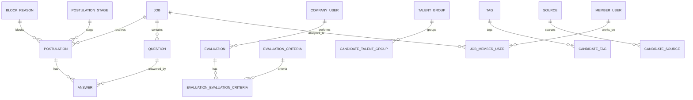
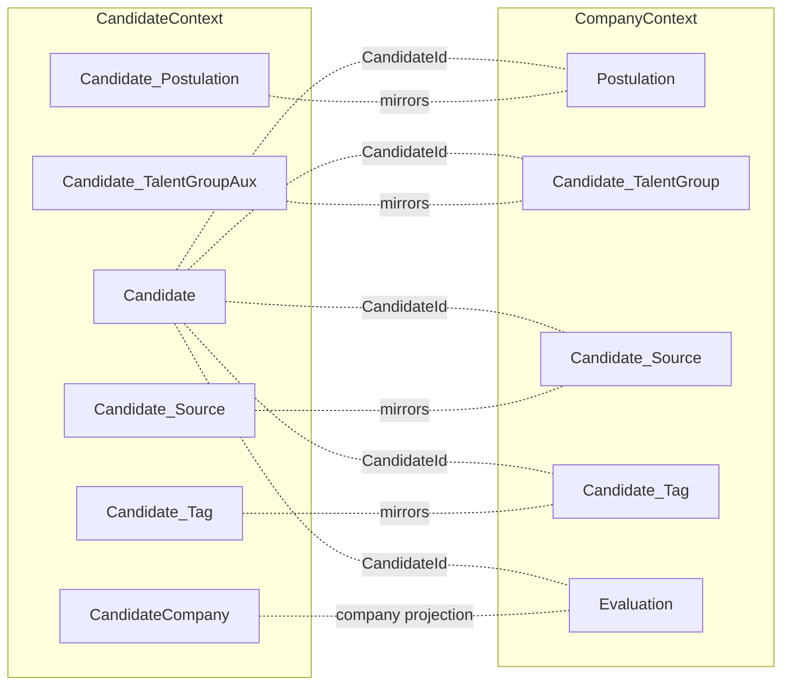
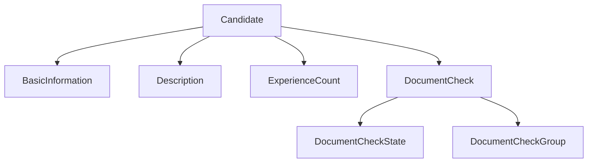
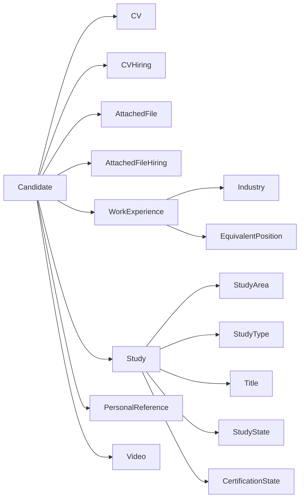
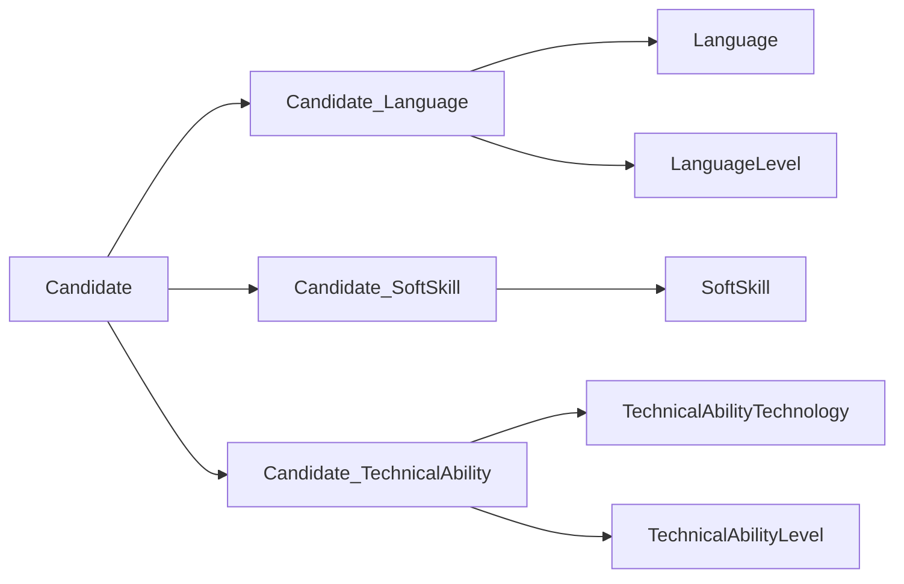
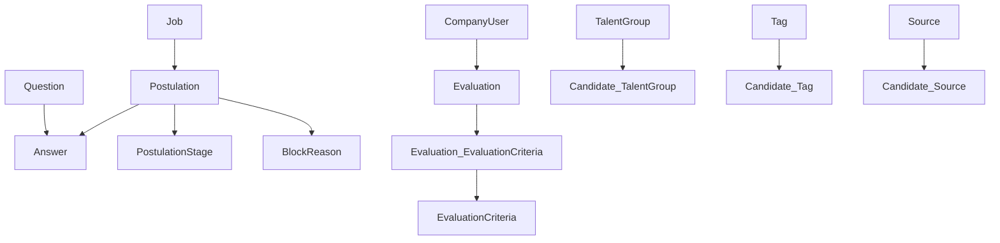

# Mapa de relaciones de base de datos (`CandidatesMS`)

## Objetivo
Documentar una vista relacional de la base de datos a partir de entidades EF Core para apoyar diseño, impacto de cambios y troubleshooting.

> Alcance: vista **arquitectónica** (no reemplaza un esquema SQL generado). Se enfoca en relaciones más relevantes de los contextos `CandidateContext` y `CompanyContext`.

## 1) Contextos y frontera de datos
- **CandidateContext**: dominio principal de candidato (perfil, CV, estudios, idiomas, experiencia, validaciones y artefactos auxiliares).
- **CompanyContext**: dominio de compañía (postulaciones, evaluaciones, tags, fuentes, talent groups, jobs, members).
- **Relación entre contextos**: se usa frecuentemente `CandidateId` como llave de vinculación lógica entre ambos dominios.
- Tablas modeladas detectadas en entidades: **157**.
- Relaciones inferidas en catálogo global: **281**.

## 2) ER de alto nivel (dominio Candidato)

```mermaid
erDiagram
    CANDIDATE ||--|| BASIC_INFORMATION : has
    CANDIDATE ||--|| DESCRIPTION : has
    CANDIDATE ||--|| EXPERIENCE_COUNT : has

    CANDIDATE ||--o{ CV : owns
    CANDIDATE ||--o{ CV_HIRING : owns
    CANDIDATE ||--o{ ATTACHED_FILE : owns
    CANDIDATE ||--o{ ATTACHED_FILE_HIRING : owns

    CANDIDATE ||--o{ STUDY : has
    CANDIDATE ||--o{ WORK_EXPERIENCE : has
    CANDIDATE ||--o{ PERSONAL_REFERENCE : has
    CANDIDATE ||--o{ VIDEO : has

    CANDIDATE ||--o{ CANDIDATE_LANGUAGE : speaks
    LANGUAGE ||--o{ CANDIDATE_LANGUAGE : catalog
    LANGUAGE_LEVEL ||--o{ CANDIDATE_LANGUAGE : level

    CANDIDATE ||--o{ CANDIDATE_SOFT_SKILL : has
    SOFT_SKILL ||--o{ CANDIDATE_SOFT_SKILL : catalog

    CANDIDATE ||--o{ CANDIDATE_TECHNICAL_ABILITY : has
    TECH_ABILITY_TECH ||--o{ CANDIDATE_TECHNICAL_ABILITY : catalog
    TECH_ABILITY_LEVEL ||--o{ CANDIDATE_TECHNICAL_ABILITY : level

    CANDIDATE ||--o{ DOCUMENT_CHECK : validates
    DOCUMENT_CHECK_GROUP ||--o{ DOCUMENT_CHECK : groups
    DOCUMENT_CHECK_STATE ||--o{ DOCUMENT_CHECK : state

    CANDIDATE ||--o{ CANDIDATE_POSTULATION : mirrors
    CANDIDATE ||--o{ CANDIDATE_TALENTGROUP_AUX : mirrors
    CANDIDATE ||--o{ CANDIDATE_TAG : mirrors
    CANDIDATE ||--o{ CANDIDATE_SOURCE : mirrors
```

## 3) ER de alto nivel (dominio Compañía)

## 4) Mapa de vinculación entre contextos (clave lógica `CandidateId`)

## 5) Entidades puente (N:M) más relevantes
- `Candidate_SoftSkill` (Candidato ↔ SoftSkill).
- `Candidate_TechnicalAbility` (Candidato ↔ Tecnología/Nivel técnico).
- `Candidate_Language` (Candidato ↔ Idioma/Nivel).
- `Candidate_Tag` y `Candidate_Source` (proyección de taxonomía de compañía sobre candidato).
- `Evaluation_EvaluationCriteria` (Evaluación ↔ Criterio de evaluación).
- `Job_MemberUser`, `Job_JobProfession`, `Job_JobLanguage`, etc. para composición de `Job`.

## 6) Observaciones arquitectónicas sobre datos
1. Existen **proyecciones espejo** candidato/compañía (`Candidate_Postulation`, `Candidate_TalentGroupAux`, `Candidate_Tag`, `Candidate_Source`) para sincronización inter-dominio.
2. `CandidateId` actúa como **identificador transversal** entre ambos contextos.
3. La separación en dos contextos reduce acoplamiento de acceso, pero exige disciplina de consistencia en operaciones distribuidas.

## 7) Recomendaciones para la siguiente iteración
1. Generar diagrama ER desde migraciones/model snapshot para validación automática de este mapa.
2. Declarar explícitamente reglas de sincronización entre entidades espejo (fuente de verdad + reconciliación).
3. Definir pruebas de contrato de datos para cruces Candidate/Company por `CandidateId`.

## 8) Submapa detallado: Perfil de candidato (núcleo)

### Llaves y cardinalidades clave
- `Candidate (1) -> (1) BasicInformation`.
- `Candidate (1) -> (1) Description`.
- `Candidate (1) -> (1) ExperienceCount`.
- `Candidate (1) -> (N) DocumentCheck`.

## 9) Submapa detallado: CV, archivos y experiencia

## 10) Submapa detallado: Skills e idiomas

## 11) Submapa detallado: Reclutamiento y evaluación (Company)

## 12) Matriz de consistencia de entidades espejo (Candidate ↔ Company)

| Proyección en CandidateContext | Entidad relacionada en CompanyContext | Clave de correlación | Riesgo principal |
|---|---|---|---|
| `Candidate_Postulation` | `Postulation` | `PostulationId` + `CandidateId` | Desalineación de estado de postulación |
| `Candidate_TalentGroupAux` | `Candidate_TalentGroup` | `CandidateId` + `TalentGroupId` | Divergencia de pertenencia a talent group |
| `Candidate_Tag` | `Candidate_Tag` | `CandidateId` + `TagId` | Tags huérfanos/duplicados |
| `Candidate_Source` | `Candidate_Source` | `CandidateId` + `SourceId` | Fuente inconsistente en reporting |

## 13) Reglas sugeridas de integridad y sincronización
1. Definir una **fuente de verdad** por cada par de espejo (recomendado: CompanyContext para reclutamiento).
2. Aplicar reconciliación idempotente por claves compuestas de negocio (`CandidateId` + dimensión).
3. Evitar deletes físicos directos en espejo; preferir marca de estado + proceso de reconciliación.
4. Registrar `CreationDate/EditionDate` en entidades de espejo para auditoría de drift.

## 14) Consultas de impacto recomendadas (cuando se modifica modelo)
- ¿Cambió una FK de `CandidateId` en entidades puente?
- ¿Cambió cardinalidad 1:1 en `BasicInformation`, `Description`, `ExperienceCount`?
- ¿Cambió dimensión de taxonomía (`Tag`, `Source`, `TalentGroup`) en CompanyContext?
- ¿Requiere backfill en proyecciones espejo de CandidateContext?

## 15) Próximo paso de la siguiente iteración
Generar un **diccionario de datos por entidad crítica** (`Candidate`, `Postulation`, `Evaluation`, `DocumentCheck`) con:
- significado de campos,
- constraints esperados,
- origen de actualización,
- y consumidores (API/reporting/integraciones).

## 16) Diccionario de datos de entidades críticas
Documento complementario con campos, reglas, orígenes de actualización y consumidores:

- `docs/diccionario-datos-entidades-criticas.md`

## 17) Catálogo completo de tablas y campos
Listado extendido por entidad con campos y relaciones inferidas desde el modelo EF Core:

- `docs/catalogo-tablas-campos-relaciones.md`

## 18) Diagrama de interacción entre bases de datos
Vista dedicada de tablas que interactúan entre CandidateContext y CompanyContext:

- `docs/diagrama-bd-interaccion-sistema.md`
