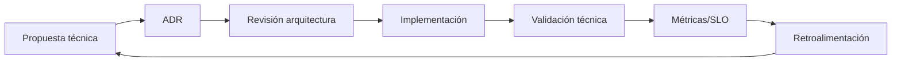

# Playbook de gobernanza de arquitectura (`CandidatesMS`)

## Objetivo
Pasar de documentación arquitectónica a **operación continua de arquitectura**, con reglas claras de decisión, calidad y seguimiento.

## 1) Alcance
Este playbook aplica a:
- cambios en diseño de módulos,
- cambios de contrato API,
- integraciones externas,
- seguridad/secretos,
- observabilidad y performance.

## 2) Modelo operativo

## 3) Cadencia recomendada
- **Semanal:** revisión de PRs con impacto arquitectónico.
- **Quincenal:** comité técnico para ADRs propuestos.
- **Mensual:** revisión de SLO/NFR y deuda técnica.
- **Trimestral:** revisión de roadmap arquitectónico.

## 4) NFR baseline (Siguiente iteración)

| Categoría | Objetivo inicial | Métrica |
|---|---|---|
| Disponibilidad | 99.5% | Uptime API |
| Latencia API | p95 < 500ms endpoints críticos | APM/Logs |
| Errores API | < 2% en endpoints críticos | ratio 5xx/total |
| Integraciones externas | p95 < 1200ms | latencia por integración |
| Seguridad | 0 secretos expuestos en repo | escaneo CI |
| Observabilidad | 100% endpoints críticos con traceId | cobertura trazas |

## 5) Matriz de riesgo arquitectónico (v1)

| Riesgo | Probabilidad | Impacto | Mitigación |
|---|---|---|---|
| Acoplamiento excesivo en servicios/controladores | Alta | Alta | Vertical slicing + límites por módulo |
| Complejidad de Startup/DI | Alta | Media | Modularización DI por dominio |
| Fallas en integraciones externas | Media | Alta | Retry, timeout, métricas, circuit breaker (fase siguiente) |
| Exposición accidental de secretos | Media | Alta | Policy + CI secret scanning |
| Deuda documental vs código | Alta | Media | DoD arquitectónico en PRs |

## 6) KPI de arquitectura (seguimiento trimestral)
1. % de PRs con referencia a ADR cuando aplica.
2. % de endpoints críticos con contrato estandarizado.
3. % de flujos críticos con diagrama actualizado.
4. Tendencia de latencia p95 en endpoints clave.
5. Tendencia de error rate en integraciones externas.

## 7) Checklist de PR con impacto arquitectónico
- [ ] ¿Incluye ADR nuevo o actualización de ADR existente?
- [ ] ¿Actualiza diagrama (C4 o flujo interno) impactado?
- [ ] ¿Define impacto en NFR/SLO?
- [ ] ¿Incluye estrategia de rollback/migración?
- [ ] ¿Incluye riesgos y mitigaciones?

## 8) Integración con documentos existentes
- Visión general: `docs/arquitectura-backend.md`
- Mapa arquitectónico: `docs/mapa-arquitectura-solucion.md`
- Flujos internos: `docs/diagramas-flujo-procesos-api.md`
- ADR + RACI iteración previa: `docs/iteracion-arquitectura-adr-matriz.md`
- ADRs individuales: `docs/adr/*`

## 9) Próximos pasos (iteración posterior)
1. Implementar plantilla ADR estándar en `docs/adr/TEMPLATE.md`.
2. Definir endpoints críticos oficiales y SLO por endpoint.
3. Agregar dashboard operativo mínimo (latencia/errores por dominio).
4. Revisar dependencias y acoplamiento por módulo trimestralmente.